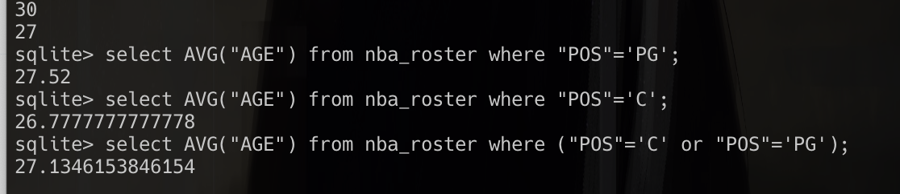

# StructureRA
Your personal assistant on structure data!

# Check if model is hallucinating

`question`: "Who is typically older: point quards or centers?"

**llama3**:
```
The average age of point guards in the NBA is 27.52 years old.
```

**llama3**:
```
The average age of centers in the NBA is approximately 26.78 years old.
```
**llama3**:
```
The average age of centers in basketball is approximately 26.78 years, 
while the average age of point guards is about 27.52 years. 
This data suggests that centers tend to be slightly younger than point guards on average.
```

**reality**:


llama3 seems accurate, good job!
